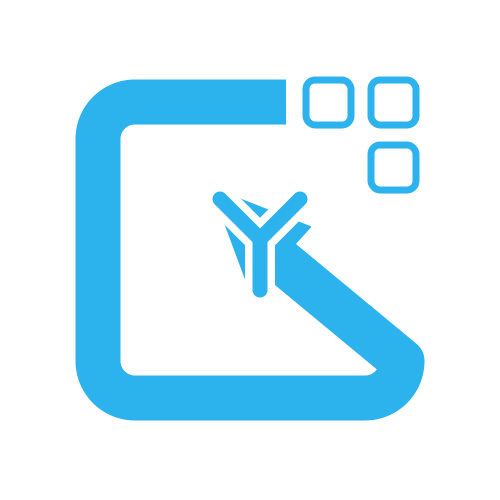
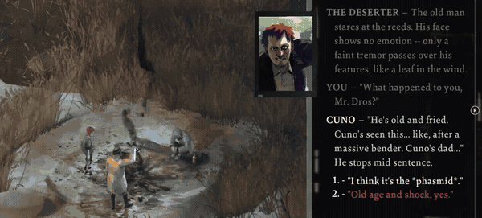
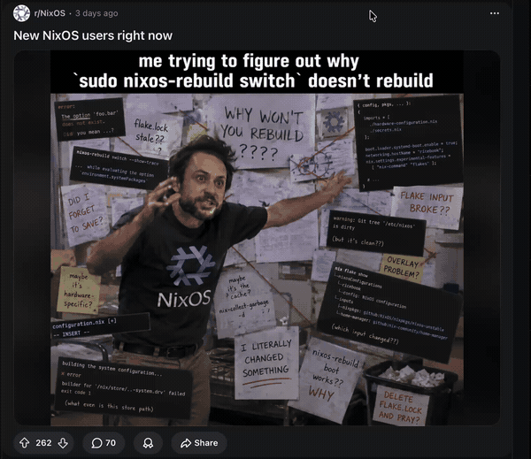
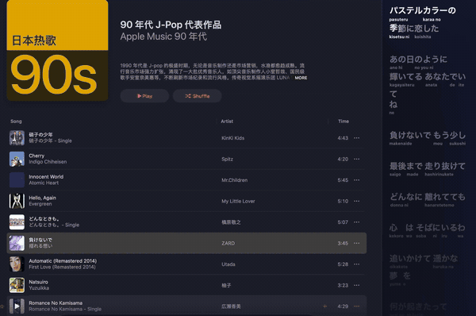
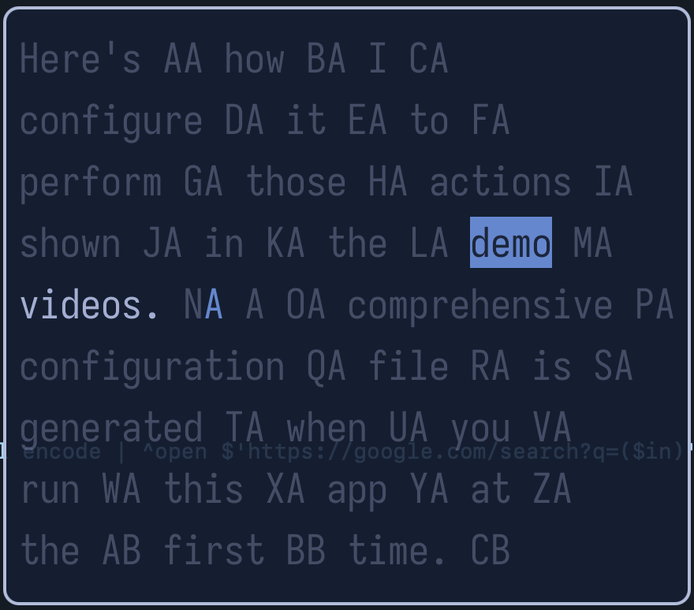
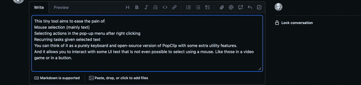
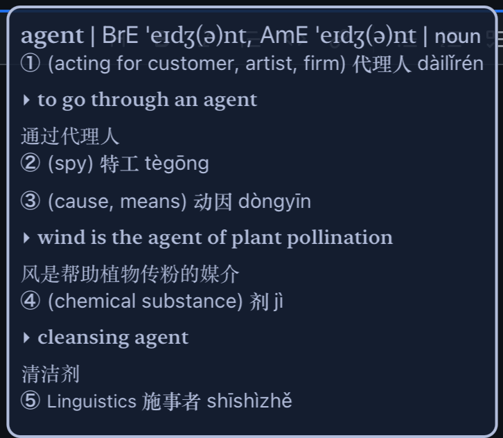

<div align="center">
  

# Glyphlow

[](https://github.com/blindFS/Glyphlow/actions/workflows/test.yml)
[](https://github.com/blindFS/Glyphlow/releases)
[](https://github.com/blindFS/Glyphlow/blob/main/LICENSE)
</div>

## Towards a Mouse Free UX for Most APPs on macOS

This tiny tool aims to ease the pain of

1. Mouse selection (mainly text)
2. Selecting actions in the pop-up menu after right clicking
3. Recurring tasks given selected text

- You can think of it as a purely keyboard and open-source version of
[PopClip](https://www.popclip.app/) with some extra utility features.
- And it allows you to interact with some UI text that is not
even possible to select using a mouse.
Like those in a video game or in a button.

## Demo

### Text Manipulation

Text can be extracted from either UI elements or Apple VisionKit OCR results


[](https://github.com/user-attachments/assets/9ec1e79c-568f-4458-8b2f-9c95b6aaf541)

### Image Copying and Input Text Editing

For users who are not satisfied with the default text editing experiences of editable
text fields, this app allows you to edit them in your favorite editor,
and automatically sync the saved content back to the UI element.

[](https://github.com/user-attachments/assets/b271c339-9733-4caa-b339-24959884af8f)

### Multi-selection

1. Toggle multi-selection mode on (Shift key)
2. Select starting/ending piece of text
3. Select the other side, and the program will automatically guess the
paragraph of intention

Here's an example of how to select and translate the lyrics in Apple Music.

[](https://github.com/user-attachments/assets/1acdabeb-bafb-4195-a3f9-ff75cb52d148)

#### Precise selection

If you want to select a specific sub-piece of text in an identified element,
you can

1. Split the whole context into pieces, the interface of word picker will pop up
2. Toggle multi-selection mode on within the word picker
3. Select both sides according to the hint keys



### Workflow

Users can define their own workflows in terms of sequences
of primitive actions.

For instance, with the following configuration snippet,
we can swiftly execute the utilities of the apple intelligence writing tool.

[](https://github.com/user-attachments/assets/3f16cc2b-4963-4cad-956d-4d0c9da5a548)

```toml
[[text_workflows]]
display = " Rewrite"
key = "R"
starting_role = "TextField"
actions = [
  "Focus",
  "SelectAll",
  "ShowMenu",
  { Sleep = 150 },
  { SearchFor = { role = "MenuItem", title = "Rewrite" } },
  "Press",
]
```

### Other Features

- UI element tree exploring mode (E)
  - Useful for debugging and screenshot taking
- Apple Dictionary support in simple pop-up window
  - Avoids the hassle of opening the dictionary app, like what PopClip will do
  - Dictionary CSS is respected to make the text more readable



- Easily extensible text actions, please refer to the [Configuration](#configuration) section
  - Avoids the hassle of plugin management, easier to share across devices
- Act on text from clipboard
- Customizable theme

## Getting Started

### Homebrew

<details>

1. Install with brew tap and start the service

```bash
brew tap blindfs/tools
brew install glyphlow
brew services start glyphlow
```

2. Grant accessibility permission to it
3. Press the global trigger (defaults to "ALT + g") to start

</details>

### Nix

<details>

1. Add another input to your system flake file

```nix
  inputs = {
    # ...
    # glyphlow
    glyphlow.url = "github:blindFS/Glyphlow";
    glyphlow.inputs.nixpkgs.follows = "nixpkgs";
  };
```

2. Add the following to your home-manager configuration

```nix
imports = [
  inputs.glyphlow.homeManagerModules.glyphlow
];

programs.glyphlow = {
  enable = true;
  settings = {
    # ...
  };
};
```

Here's an [example](https://github.com/blindFS/modern-dot-files/blob/main/nix/modules/home/glyphlow.nix)
written in [dendritic pattern](https://github.com/mightyiam/dendritic).

3. Grant accessibility permission to it
4. Press the global trigger (defaults to "ALT + g") to start

</details>

## Purging

This app is designed to be lean and clean, it only generates 2 files:

1. A configuration file `$XDG_CONFIG_HOME/glyphlow/config.toml` or
`~/.config/glyphlow/config.toml` if the env-var is not set.
2. A cache file for temporary editing: `$XDG_CACHE_HOME/glyphlow/tempfile.md`
or `~/.cache/glyphlow/tempfile.md`.

## Configuration

A comprehensive configuration file is generated when you run this app at the first time.

<details>
<summary><b>Full List of Configuration Options</b></summary>

### General Options

| Name | Description | Default Value |
| :--- | :--- | :--- |
| `global_trigger_key` | Global hotkey to trigger the app | `ALT + G` |
| `editor` | External editor command for editing text fields | `None` |
| `text_actions` | Custom text actions (e.g., search, translate) | `[]` |
| `workflows` | Sequences of primitive actions for specific UI roles | `[Default Workflows]` |
| `scroll_distance` | Relative distance to scroll when using scroll actions | `0.05` |
| `hide_scrolling_menu` | Whether to hide the menu when scrolling | `false` |
| `element_min_width` | Minimum width for UI elements to be considered | `15` |
| `element_min_height` | Minimum height for UI elements to be considered | `15` |
| `image_min_size` | Minimum size (width/height) for images | `20` |
| `colored_frame_min_size` | Minimum size for frames to be colored differently | `200` |
| `ocr_languages` | Languages to use for OCR (Apple VisionKit) | `["en-US"]` |
| `dictionaries` | Dictionary names for the built-in dictionary lookup | `["New Oxford American Dictionary"]` |
| `visibility_checking_level` | Rigor level for checking if an element is visible (`Loosest`, `Loose`, `Medium`, `Strict`) | `Loose` |
| `electron_initial_wait_ms` | Delay for Electron-based apps to bootstrap | `100` |

### Theme Options

| Name | Description | Default Value |
| :--- | :--- | :--- |
| `theme.hint_font` | Font used for hint keys | `Andale Mono:12` |
| `theme.hint_margin_size` | Margin around the hint text | `3` |
| `theme.hint_bg_color` | Background color of hint box | $\color{#769ff0}{\blacksquare}$ |
| `theme.hint_fg_color` | Foreground (text) color of hint box | $\color{#111726}{\blacksquare}$ |
| `theme.hint_hl_color` | Faded color of matching prefixes | $\color{#111726}{\blacksquare}$ |
| `theme.menu_font` | Font used for the menu | `Andale Mono:20` |
| `theme.menu_margin_size` | Margin around the menu window | `10` |
| `theme.menu_bg_color` | Background color of the menu | $\color{#111726}{\blacksquare}$ |
| `theme.menu_fg_color` | Foreground (text) color of the menu | $\color{#a3aed2}{\blacksquare}$ |
| `theme.menu_hl_color` | Highlight color of the menu | $\color{#769ff0}{\blacksquare}$ |
| `theme.frame_colors` | Colors used for large UI element frames | [ $\color{#e0af68}{\blacksquare}$, $\color{#9ece6a}{\blacksquare}$, $\color{#bb9af7}{\blacksquare}$, $\color{#f7768e}{\blacksquare}$ ] |
| `theme.enable_animation` | Animations for mouse events | `true` |

</details>

### Example

And here's how I configure it to perform those actions shown in the demo videos.

<details>
<summary>An example of TOML configuration file</summary>

```toml
colored_frame_min_size = 100
element_min_width = 15
element_min_height = 15
ocr_languages = [
  "zh-Hans",
  "ja-JP",
  "en-US",
]
dictionaries = [
  "牛津英汉汉英词典",
  "New Oxford American Dictionary",
]

[[text_actions]]
display = "󰊭 Google Search"
key = 'G'
command = "nu"
args = ["-c", "r#'{glyphlow_text}'# | url encode | ^open $'https://google.com/search?q=($in)'"]

[[text_actions]]
display = "󰖬 Wikipedia Search"
key = 'W'
command = "nu"
args = ["-c", "r#'{glyphlow_text}'# | url encode | ^open $'https://en.wikipedia.org/wiki/Special:Search/($in)'"]

[[text_actions]]
display = "󰊿 Goolge Translate -> zh_cn"
key = 'T'
command = "nu"
args = ["-c", "r#'{glyphlow_text}'# | url encode | ^open $'https://translate.google.com/?sl=auto&tl=zh_cn&text=($in)&op=translate'"]

[editor]
display = " Editor"
key = 'V'
# command = "tmux"
# args = ["new-window", "-t", "dev", "^open -a Ghostty; ^nvim {glyphlow_temp_file}"]
command = "open"
args = ["-a", "Zed", "{glyphlow_temp_file}"]

[theme]
hint_font = "AndaleMono:16"
menu_font = "IosevkaTerm Nerd Font Mono:26"
```

</details>

## Roadmap

1. [X] nix-flake
2. [ ] menu bar icon

## Acknowledgements

This project is inspired by

1. [Neru](https://github.com/y3owk1n/neru)
2. [PopClip](https://www.popclip.app/)
3. [Smartisan Big Bang](https://github.com/SmartisanTech/android)
